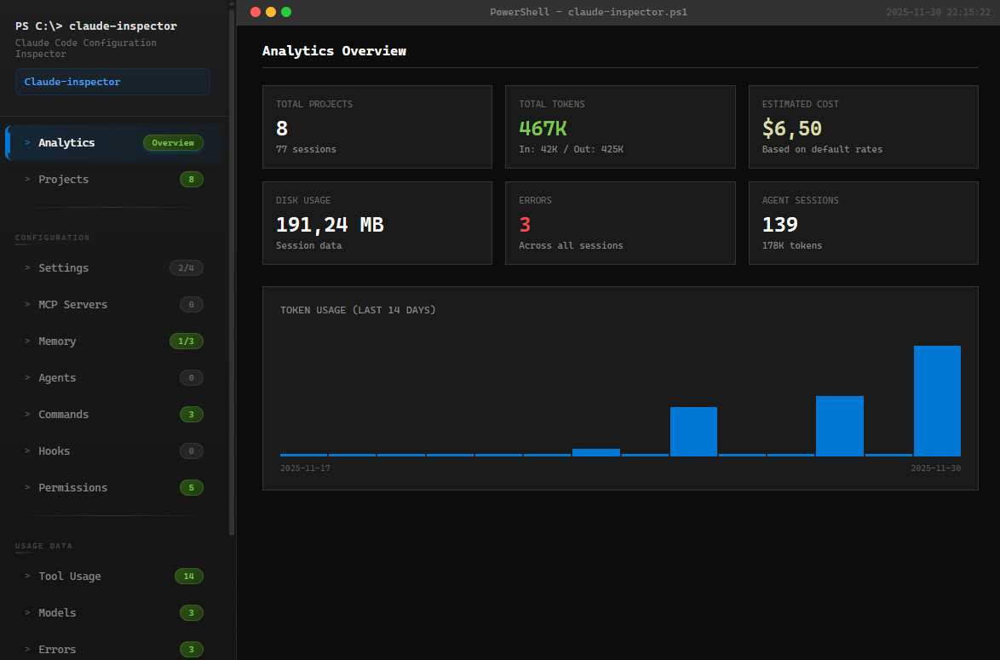

# Claude Code Inspector

A PowerShell script that scans and analyzes all Claude Code configuration files, generating an interactive HTML dashboard with comprehensive usage statistics.



## Why This Script?

Claude Code stores configuration across multiple locations (global and project-level), making it difficult to:

- **Track tool usage** - Which tools (Bash, Read, Write, Edit, Grep, etc.) are used most frequently
- **Monitor costs** - Estimate API spending based on token consumption
- **Analyze sessions** - Understand usage patterns across all projects
- **Audit permissions** - Review allow/deny/ask rules across settings levels
- **Detect conflicts** - Find conflicting permission rules between global and project settings
- **Maintain hygiene** - Identify orphan projects, stale data, and corrupted session files

This inspector consolidates everything into a single dashboard for complete visibility.

## Installation

### As a Global Claude Command (Recommended)

Create a global slash command to run the inspector from any Claude Code session:

1. Create the commands directory:
```powershell
New-Item -ItemType Directory -Path "$env:USERPROFILE\.claude\commands" -Force
```

2. Create the command file:
```powershell
@'
# Claude Code Inspector

Run the Claude Code Inspector to generate an HTML dashboard showing all Claude Code configuration.

## Instructions

Execute the following PowerShell command to run the inspector:

```powershell
powershell -ExecutionPolicy Bypass -File "C:\path\to\claude-inspector.ps1"
```
'@ | Out-File "$env:USERPROFILE\.claude\commands\inspect.md" -Encoding UTF8
```

3. Now use `/inspect` from any Claude Code session

### Direct Execution

```powershell
# Run and open report in browser
.\claude-inspector.ps1

# Generate without opening browser
.\claude-inspector.ps1 -NoOpen

# Inspect a different project
.\claude-inspector.ps1 -ProjectPath "C:\path\to\project"
```

## Features

### Analytics Dashboard
- **Total Projects** - Number of projects with Claude Code sessions
- **Token Usage** - Input/output tokens with breakdown
- **Cost Estimation** - Estimated API costs based on model rates
- **Disk Usage** - Storage consumed by session data
- **Error Tracking** - Errors detected across sessions
- **Agent Sessions** - Subagent activity and token usage
- **14-Day Chart** - Visual timeline of daily token usage

### Configuration Inspection
| Section | Description |
|---------|-------------|
| Settings | Global and project settings.json files |
| MCP Servers | Configured Model Context Protocol servers |
| Memory | CLAUDE.md files (instructions/context) |
| Agents | Custom agent definitions |
| Commands | Custom slash commands |
| Hooks | Pre/post tool execution hooks |
| Permissions | Tool permission rules (allow/deny/ask) |

### Usage Statistics
| Section | Description |
|---------|-------------|
| Tool Usage | Bar chart showing which tools are called most |
| Models | Distribution of model usage (Opus, Sonnet, Haiku) |
| Errors | List of errors extracted from session logs |

### Maintenance Tools
| Section | Description |
|---------|-------------|
| Cleanup | Orphan projects, stale sessions, corrupted files |
| Conflicts | Permission conflicts between settings levels |
| Recommendations | Configuration and cleanup suggestions |

## Configuration Paths Scanned

**Global Configuration:**
- `~/.claude/settings.json` - Global settings
- `~/.claude/settings.local.json` - User-specific overrides
- `~/.claude/CLAUDE.md` - Global instructions
- `~/.claude/agents/` - Custom agents
- `~/.claude/commands/` - Custom slash commands
- `~/.claude/projects/` - Session data for all projects

**Project Configuration:**
- `.claude/settings.json` - Project settings
- `.claude/settings.local.json` - Local overrides
- `.claude/CLAUDE.md` - Project instructions
- `CLAUDE.md` - Root project instructions
- `.mcp.json` - MCP server configuration

## Cost Estimation Rates

Based on Anthropic's published pricing (per 1M tokens):

| Model | Input | Output |
|-------|-------|--------|
| Claude Opus 4 | $15.00 | $75.00 |
| Claude Sonnet 4 | $3.00 | $15.00 |
| Claude 3.5 Sonnet | $3.00 | $15.00 |
| Claude 3.5 Haiku | $0.80 | $4.00 |
| Claude 3 Haiku | $0.25 | $1.25 |

## Output

The script generates a self-contained HTML file (`claude-inspector-report.html`) with:
- No external dependencies
- Embedded CSS and JavaScript
- PowerShell terminal-inspired dark theme
- Interactive sortable tables
- Expandable content blocks
- Responsive sidebar navigation

## Requirements

- Windows PowerShell 5.1+ or PowerShell Core 7+
- Claude Code installed and configured

## License

MIT License - Feel free to modify and distribute.
